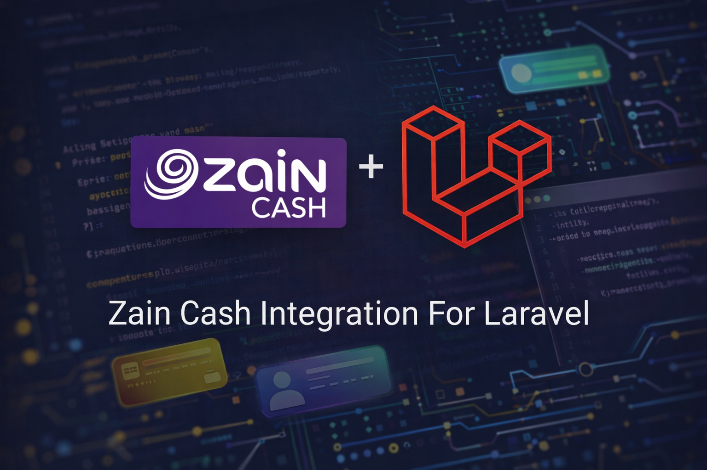

# ZainCash Integration For Laravel

[](https://packagist.org/packages/ht3aa/zain-cash)
[](https://packagist.org/packages/ht3aa/zain-cash)

This is a laravel package that provide all the functionality that you need to integrate your app with zain cash gateway api



## Installation

You can install the package via composer:

```bash
composer require ht3aa/zain-cash
```

## Changelog

Please see [CHANGELOG](CHANGELOG.md) for more information on what has changed recently.

## Contributing

Please see [CONTRIBUTING](CONTRIBUTING.md) for details.

## Security Vulnerabilities

Please review [our security policy](../../security/policy) on how to report security vulnerabilities.

## Credits

- [Hasan Tahseen](https://github.com/ht3aa)
- [All Contributors](../../contributors)

## License

The MIT License (MIT). Please see [License File](LICENSE.md) for more information.
