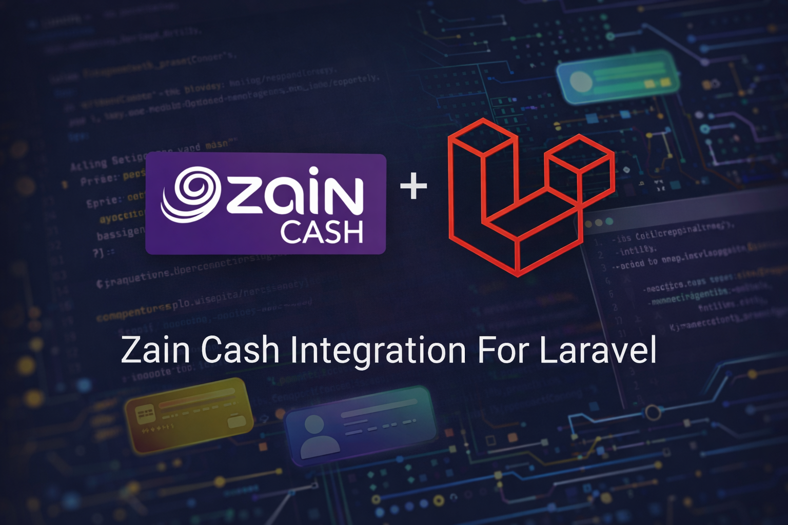

# ZainCash Integration For Laravel

[](https://packagist.org/packages/ht3aa/zain-cash)
[](https://packagist.org/packages/ht3aa/zain-cash)

A comprehensive Laravel package for integrating ZainCash payment gateway into your application. This package provides a simple and elegant way to handle payment transactions, webhooks, and transaction tracking with ZainCash.



## Features

- ✅ Easy integration with ZainCash payment gateway
- ✅ Automatic transaction tracking and management
- ✅ Webhook handling for payment status updates
- ✅ Support for both production and test environments
- ✅ JWT token generation and validation
- ✅ Database transaction logging
- ✅ Custom webhook URL support
- ✅ Built-in error handling and logging

## Installation

You can install the package via composer:

```bash
composer require ht3aa/zain-cash
```

Publish the configuration file:

```bash
php artisan vendor:publish --tag="zain-cash-config"
```

Publish and run the migrations:

```bash
php artisan vendor:publish --tag="zain-cash-migrations"
php artisan migrate
```

## Configuration

Add the following environment variables to your `.env` file:

```env
ZAIN_CASH_IS_PRODUCTION=false
ZAIN_CASH_MERCHANT_ID=your_merchant_id
ZAIN_CASH_MERCHANT_SECRET=your_merchant_secret
ZAIN_CASH_MSISDN=your_msisdn
ZAIN_CASH_WEBHOOK_URL="${APP_URL}/api/zain-cash/webhook"
ZAIN_CASH_CUSTOM_WEBHOOK_URL=
```

### Configuration Options

- `ZAIN_CASH_IS_PRODUCTION`: Set to `true` for production environment, `false` for testing
- `ZAIN_CASH_MERCHANT_ID`: Your ZainCash merchant ID
- `ZAIN_CASH_MERCHANT_SECRET`: Your ZainCash merchant secret key
- `ZAIN_CASH_MSISDN`: Your registered mobile number with ZainCash
- `ZAIN_CASH_WEBHOOK_URL`: The URL where ZainCash will send payment status updates
- `ZAIN_CASH_CUSTOM_WEBHOOK_URL`: (Optional) Custom URL to receive payment notifications in your app

## Usage

### Creating a Payment Transaction

To initiate a payment transaction, create a new `ZainCashTransaction` instance and pass it to the `initiateTransaction` method:

```php
use Ht3aa\ZainCash\Models\ZainCashTransaction;
use Ht3aa\ZainCash\Facades\ZainCash;

// Create a new transaction
$transaction = ZainCashTransaction::create([
    'amount' => 10000, // Amount in IQD (e.g., 10000 IQD)
    'service_type' => 'Product Purchase',
    'order_id' => 'ORDER-' . uniqid(),
    'redirect_url' => route('payment.callback'),
]);

// Initiate the transaction with ZainCash
$transaction = ZainCash::initiateTransaction($transaction);
$transaction->save();

// Redirect user to payment page
return redirect($transaction->payment_redirect_url);
```

### Transaction Model

The `ZainCashTransaction` model includes the following attributes:

- `amount`: Payment amount in IQD
- `service_type`: Description of the service/product
- `order_id`: Unique order identifier
- `redirect_url`: URL to redirect after payment
- `token`: JWT token for the transaction
- `iat`: Token issued at timestamp
- `exp`: Token expiration timestamp
- `zain_cash_response`: Full response from ZainCash API
- `status`: Transaction status (pending, completed, failed, etc.)
- `payment_redirect_url`: URL to redirect user for payment
- `transaction_id`: ZainCash transaction ID

### Webhook Handling

The package automatically registers a webhook route at `/api/zain-cash/webhook` to handle payment status updates from ZainCash.

When a payment is completed, ZainCash will send a callback to this URL with the transaction status. The webhook controller will:

1. Decode the JWT token from ZainCash
2. Update the transaction status in your database
3. (Optional) Forward the notification to your custom webhook URL

### Custom Webhook Notifications

If you want to receive notifications in your own application when a payment status is updated, set the `ZAIN_CASH_CUSTOM_WEBHOOK_URL` in your `.env` file:

```env
ZAIN_CASH_CUSTOM_WEBHOOK_URL=https://yourapp.com/api/payment-notification
```

The package will POST to this URL with the following payload:

```json
{
    "zain_cash_transaction_id": 123
}
```

You can then create your own controller to handle this:

```php
use Ht3aa\ZainCash\Models\ZainCashTransaction;

public function handlePaymentNotification(Request $request)
{
    $transaction = ZainCashTransaction::find($request->zain_cash_transaction_id);
    
    if ($transaction->status === 'success') {
        // Payment successful - update your order, send confirmation email, etc.
    } else {
        // Payment failed - handle accordingly
    }
}
```

### Checking Transaction Status

You can check the status of a transaction at any time:

```php
use Ht3aa\ZainCash\Models\ZainCashTransaction;

$transaction = ZainCashTransaction::where('order_id', 'ORDER-123')->first();

if ($transaction->status === 'success') {
    // Payment completed
} elseif ($transaction->status === 'pending') {
    // Payment still pending
} else {
    // Payment failed or cancelled
}
```

### Using the Facade

The package provides a facade for easy access:

```php
use Ht3aa\ZainCash\Facades\ZainCash;

$transaction = ZainCash::initiateTransaction($zainCashTransaction);
```

## Example Flow

Here's a complete example of a payment flow:

```php
// 1. Create order and initiate payment
public function initiatePayment(Request $request)
{
    $transaction = ZainCashTransaction::create([
        'amount' => $request->amount,
        'service_type' => 'Product Purchase',
        'order_id' => 'ORDER-' . time(),
        'redirect_url' => route('payment.callback'),
    ]);

    $transaction = ZainCash::initiateTransaction($transaction);
    $transaction->save();

    return redirect($transaction->payment_redirect_url);
}

// 2. Handle callback (optional - webhook handles status updates automatically)
public function paymentCallback(Request $request)
{
    return view('payment.processing');
}

// 3. Handle custom webhook notification
public function handlePaymentNotification(Request $request)
{
    $transaction = ZainCashTransaction::find($request->zain_cash_transaction_id);
    
    if ($transaction->status === 'success') {
        // Update order status
        Order::where('order_id', $transaction->order_id)
            ->update(['payment_status' => 'paid']);
            
        // Send confirmation email
        Mail::to($user)->send(new PaymentConfirmation($transaction));
    }
    
    return response()->json(['message' => 'Notification received']);
}
```

## Testing

The package includes test credentials for the ZainCash sandbox environment. Make sure `ZAIN_CASH_IS_PRODUCTION` is set to `false` when testing.

## Changelog

Please see [CHANGELOG](CHANGELOG.md) for more information on what has changed recently.

## Contributing

Please see [CONTRIBUTING](CONTRIBUTING.md) for details.

## Security Vulnerabilities

Please review [our security policy](../../security/policy) on how to report security vulnerabilities.

## Credits

- [Hasan Tahseen](https://github.com/ht3aa)
- [All Contributors](../../contributors)

## License

The MIT License (MIT). Please see [License File](LICENSE.md) for more information.
